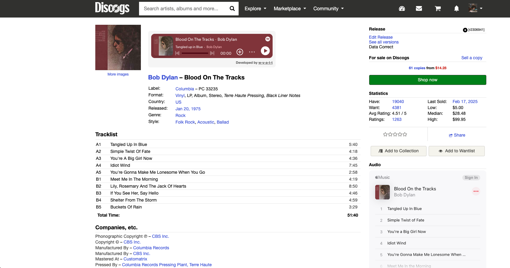

# Discogs Spotify Extension

A userscript that automatically embeds Spotify players on Discogs release and master pages, making it easy to listen to albums while browsing Discogs.

## What This Extension Does

This extension enhances your Discogs browsing experience by automatically finding and embedding Spotify players for the albums you're viewing. When you visit a release or master page on Discogs, the extension:

1. Extracts the artist and album information from the page
2. Searches Spotify for matching content using a smart matching algorithm
3. Embeds a Spotify player directly on the page if a match is found
4. Provides a clean, unobtrusive interface that integrates with Discogs' design

## Detailed Features

- **Automatic Detection**: Intelligently extracts release and artist information from Discogs pages
- **Smart Matching**: Uses a sophisticated algorithm to find the correct album on Spotify, even with slight naming differences
- **Embedded Players**: Seamlessly integrates Spotify players directly in the Discogs page
- **Various Artists Support**: Special handling for compilations and "Various Artists" releases
- **Edge Case Handling**: Attempts to handle different naming formats, special characters, and other edge cases
- **Authentication Management**: Manages Spotify authentication tokens securely
- **Responsive Design**: Clean UI that matches Discogs' style and works across different screen sizes

## Step-by-Step Installation

### 1. Install a Userscript Manager

First, you need a userscript manager extension for your browser:

- **Chrome/Edge**: [Tampermonkey](https://www.tampermonkey.net/) (recommended)
- **Firefox**: [Tampermonkey](https://www.tampermonkey.net/) or [Greasemonkey](https://addons.mozilla.org/en-US/firefox/addon/greasemonkey/)
- **Safari**: [Tampermonkey](https://www.tampermonkey.net/index.php?browser=safari)

### 2. Create a Spotify Developer Application

You'll need your own Spotify API credentials:

1. Go to the [Spotify Developer Dashboard](https://developer.spotify.com/dashboard)
2. Log in with your Spotify account
3. Click "Create an App"
4. Fill in the app name (e.g., "My Discogs Spotify Extension") and description
5. Check the terms of service and click "Create"
6. In your new app's dashboard, click "Edit Settings"
7. Under "Redirect URIs", add: `https://www.discogs.com/callback`
8. Save the settings
9. On the app dashboard, note your "Client ID" (you'll need this in the next step)

### 3. Install the Script

1. Click on the raw script file in this repository or copy its contents
2. Open your userscript manager (e.g., click the Tampermonkey icon and select "Create a new script")
3. Paste the script code into the editor
4. Find the line that says `clientId: 'Your Spotify Client ID'` (around line 32)
5. Replace `'Your Spotify Client ID'` with your actual Spotify Client ID from step 2, keeping the quotes (e.g., `clientId: '1a2b3c4d5e6f7g8h9i0j'`)
6. Save the script (Ctrl+S or File > Save)
7. Make sure the script is enabled in your userscript manager

### 4. Verify Installation

1. Go to any [Discogs release page](https://www.discogs.com/release/2306941-Bob-Dylan-Blood-On-The-Tracks?ev=) or [master page](https://www.discogs.com/master/3878-Bob-Dylan-Blood-On-The-Tracks)
2. You should see either:
   - A Spotify player at the top of the page if the album was found
   - A "Connect Spotify to View Player" button if you need to authorize the application
   - A message saying "Album not found on Spotify" if no match was found

## How to Use

1. Browse to any release or master page on Discogs
2. The first time you use the extension, click "Connect Spotify to View Player"
3. You'll be redirected to Spotify to authorize the application
4. After authorization, you'll be redirected back to Discogs
5. The extension will automatically search for and display the Spotify player
6. The player allows you to:
   - Play the album directly on the page
   - Control playback (play, pause, skip)
   - Click through to open the album in Spotify

## Troubleshooting

### Common Issues

- **No player appears**: Make sure the script is enabled in your userscript manager
- **"Album not found"**: The album might not be available on Spotify or the matching algorithm couldn't find it
- **Authentication errors**: Try clicking the "Connect Spotify" button again, or clear your browser cookies and retry
- **Script errors**: Check your browser console for error messages

### Spotify Token Expiration

The Spotify authentication token expires after 50 minutes. The extension will automatically prompt you to reconnect when needed.

## Technical Details

### Permissions Explained

The script requires several permissions to function properly:

- `GM_xmlhttpRequest`: Allows the script to make API calls to Spotify
- `GM_addStyle`: Enables adding custom CSS styles to the page
- `GM_setValue/GM_getValue`: Used for storing authentication data between sessions
- `GM_openInTab`: Required for the Spotify authentication process
- `GM_deleteValue`: Used to clear expired authentication tokens

### How the Matching Algorithm Works

The extension uses a sophisticated matching algorithm that:

1. Extracts artist and album title from the Discogs page
2. Cleans up the text by removing common words, special characters, etc.
3. Uses multiple search strategies with the Spotify API
4. Calculates similarity scores between Discogs and Spotify results
5. Applies different matching thresholds based on the type of release

## Contributing

Contributions are welcome! Here's how you can help:

1. **Report bugs**: If you find an issue, please [open an issue](https://github.com/w-y-a-t-t/discogs-spotify-extension/issues) with details
2. **Suggest features**: Have an idea? Share it in the issues section
3. **Submit code**: Fork the repository, make your changes, and submit a pull request
4. **Improve documentation**: Help make these instructions clearer

### Development Setup

1. Fork and clone the repository
2. Make your changes to the script
3. Test thoroughly with different types of Discogs pages
4. Submit a pull request with a clear description of your changes

## License

This project is licensed under the MIT License - see the LICENSE file for details.

## Author

Created by [w-y-a-t-t](https://github.com/w-y-a-t-t)

## Support

If you encounter any issues or have suggestions, please [open an issue](https://github.com/w-y-a-t-t/discogs-spotify-extension/issues) on GitHub.

## Privacy

This extension:
- Only accesses data on Discogs release and master pages
- Only communicates with the Spotify API
- Stores authentication tokens locally in your browser
- Does not collect any personal data
- Does not track your browsing activity

### Authentication Process

When connecting to Spotify, you'll be redirected to Spotify's authorization page. After granting permission, you'll briefly see a loading screen while the authentication completes, and then you'll be automatically redirected back to the Discogs page you were viewing.